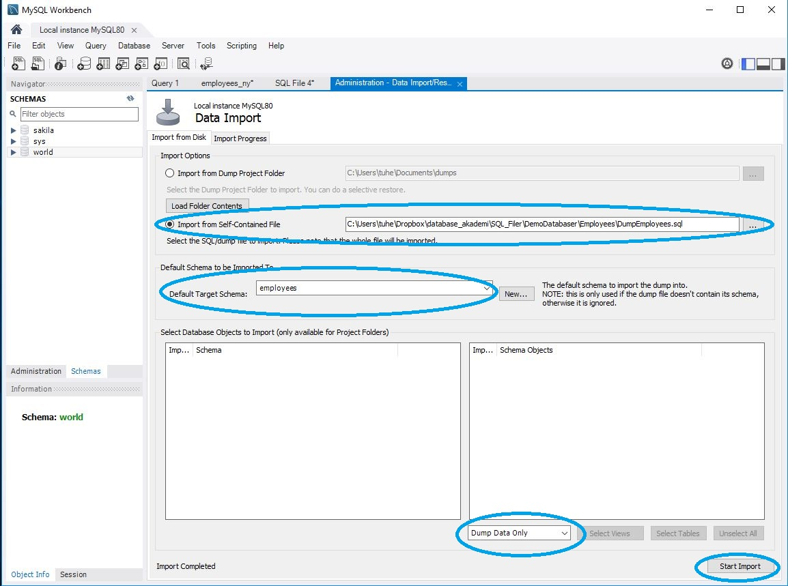
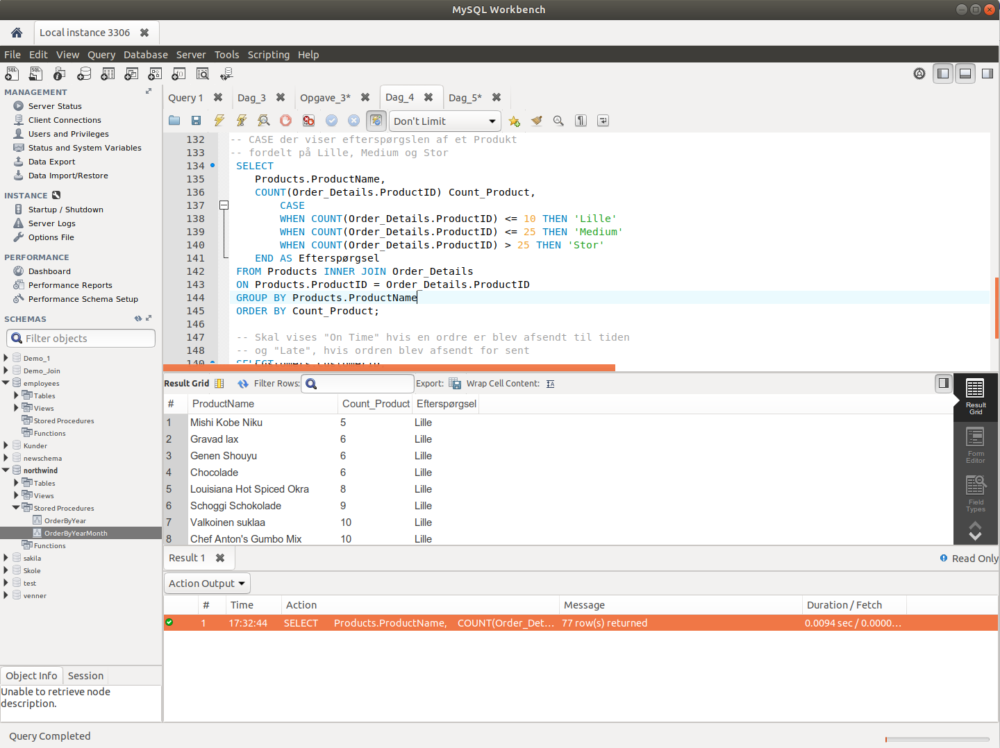

[Retur](README.md)

# Kursusgang 1

## Introduktion
Det er Open Source databasen - MySQL du skal bruge.

Den kan installeres på Windows, Mac og Linux. 

Du kan læse mere om MySQL her: [Link](https://www.mysql.com "www.mysql.com")


## MySQL Installation
**Windows**

Du kan finde en vejledning for installation på Windows her: [Link](https://dev.mysql.com/doc/refman/8.0/en/windows-installation.html "https://dev.mysql.com/doc/refman/8.0/en/windows-installation.html")


**Installationsvideo Windows (MySQL, WorkBench)**

Du kan finde en Installationsvideo til Windows her: [Link](https://www.youtube.com/watch?v=xRMYVBefHY4)

**Mac**

Du kan finde en vejledning for installation på Mac her: [Link](https://dev.mysql.com/doc/refman/8.0/en/osx-installation.html "https://dev.mysql.com/doc/refman/8.0/en/osx-installation.html")

**Installationsvideo Mac (MySQL, WorkBench, installation af Northwind og Employees)**

Du kan finde en Installationsvideo til Mac her: [Link](https://www.youtube.com/watch?v=DZuMvmvpo6w)

## Demo databaser
*Hvad er et database kursus uden data?*

Der er 2 demo databaser vi skal bruge på dette kursus:

* Northwind
* Employees

## Northwind
Denne database er en Microsoft har brugt i mange år. Den indeholder 13 tabeller

**ER-diagram - Northwind**


Kan også hentes som PDF her: [Link](https://www.dropbox.com/s/g7rp0f9ghpy6fs3/Northwind.pdf?dl=0 "https://www.dropbox.com/s/g7rp0f9ghpy6fs3/Northwind.pdf?dl=0")

**Installation**  
Du skal følge disse trin for at få installeret *Northwind* databasen:

1. Hent zip filen **Northwind.zip** herfra [Link](https://www.dropbox.com/s/t87rc4gvy7qkb2l/Northwind.zip?dl=0 "https://www.dropbox.com/s/t87rc4gvy7qkb2l/Northwind.zip?dl=0")
2. Pak fil ud - den indeholder to filer
3. Åben filen **Northwind.sql** i Workbench
4. Kør filen
5. Det tager "noget" tid at oprette databasen og indsætte data


## Employees
Denne database er en af MySQL's officielle demo databaser.  
Se mere på deres www side - [Link](https://dev.mysql.com/doc/employee/en/ "https://dev.mysql.com/doc/employee/en/")
 
> The Employees sample database was developed by Patrick Crews and Giuseppe Maxia and provides a combination of a large base of data (approximately 160MB) spread over six separate tables and consisting of 4 million records in total. The structure is compatible with a wide range of storage engine types. Through an included data file, support for partitioned tables is also provided.

MySQL har også en officiel beskrivelse som kan hentes her: [Link](https://downloads.mysql.com/docs/employee-en.a4.pdf "https://downloads.mysql.com/docs/employee-en.a4.pdf")

**ER-Diagram - Employees**


Kan også hentes som PDF her: [Link](https://www.dropbox.com/s/qqvy3t2svgdnqln/ER_Employee.pdf?dl=0 "https://www.dropbox.com/s/qqvy3t2svgdnqln/ER_Employee.pdf?dl=0")


**Installation**
Du skal følge disse trin for at få installeret *Employee* databasen:

1. Hent filen zip filen: **employees.zip** herfra: [Link](https://www.dropbox.com/s/mx3eue4s35hdczc/employees.zip?dl=0 "https://www.dropbox.com/s/mx3eue4s35hdczc/employees.zip?dl=0")
2. Pak zip-fil ud - den indeholder 2 filer
3. Åben filen: **employess.sql** i Workbench
4. Kør denne fil, ved at trykke på "Lynet"

Databasen **employees** er nu oprettet. Nu skal data importeres fra *Dump* filer.

1. Klik på **Server**
2. Klik **Data import**
3. Vælg filen **DumpEmployees.sql** under **Import from Self-Contained File**
4. Vælg **Default Target Schema** til **employees**
5. Vælg **Dump Data Omly** i drop down menu
6. Klik på **Start Import** (Det tager "lidt" tid før den er færdig! - Når knappen **Import Agin** er aktiv er importen slut)



Databasen **employess** er nu importeret og klar til brug


# MySQL Workbench Introduktion

MySQL Workbench er det grafiske program som du skal bruge til dit arbejde med MySQL serveren.

Der findes en online manual til [Workbench](https://dev.mysql.com/doc/workbench/en/wb-intro.html)

MySQL Workbench understøtter:

- SQL Development
- Data Modeling (Design)
- Server administration
- Data Migration
- MySQL Enterprise Support

MySQL Workbench kan findes i tre versioner; *MySQL Workbench Community Edition*, *MySQL Workbench Standard Edition* og *MySQL Workbench Enterprise Edition*.

*MySQL Workbench Community Edition* er Open Source (GLP Licens) og er dermed gratis at bruge, det er den version vi kommer til at bruge.

Du kan læse mere om forskellene på de tre versioner her: [MySQL Workbench Features](https://www.mysql.com/products/workbench/features.html)

**Hoved vinduet i Workbench**



# SQL introduktion

## SELECT
**SELECT** er nok den mest brugte SQL kommando.
Den bruges til at hente data ud af din database.

**Syntax SELECT**

```sql
	SELECT kolonne_1, kolonne_2,  ...
	FROM tabel_navn;
	
	SELECT * FROM tabel_navn
```

**Northwind Syntax SELECT**

```
	select * from Employees;

	select 
		EmployeeID,
    	FirstName,
    	LastName
	from Employees;
```

## Kommentarer

Det kan være en rigtig god ide at skrive kommentarer til dine SQL koder.
Der er to forskellige muligheder for  kommentarer

- På en enkelt linje - her brugere du: --
- Over flere linjer - her brugere du: /* kommentar */

**Eksempeler på en kommentar på en linje

```
--Select all
SELECT * FROM Customers;

SELECT * FROM Customers -- WHERE City='Berlin';
```

Hvis du gerne vil skrive en kommentar der fylder mere end en linje eller det er flere linjer kode du gerne vil ud-kommenter skal du bruge denne metode:

```
/* 
	Vælg alle kolonner
	og alle poster 
	i Customers tabellen 
*/

SELECT * FROM Customers;
```

Alt imellem /* og */ bliver ignoreret.
 

## DISTINCT
Bruges sammen med **SELECT** til at returnere unikke værdier. Altså kun en af hver værdi.

**Syntax DISTINCT**

```
	SELECT DISTINCT kolonne_1, kolonne_2,  ...
	FROM tabel_navn;
```

**Northwind Syntax DISTINCT**

```
	select distinct Country from Customers;
```
## WHERE
Bruges sammen med **SELECT** for at udvælge data.   
Det er kun de data der opfylder dit krav (**WHERE**) der vises.

**Syntax WHERE**

```
	SELECT kolonne_1, kolonne_2,  ...
	FROM tabel_navn
	WHERE betingelse;
```

**Northwind Syntax WHERE**

```
	select * from Customers
	where Country = 'Denmark';
```

**WHERE** kan også bruges sammen med andre SQL kommandoer end **SELECT**. F.eks. **UPDATE** og **DELETE**

## AND, OR, NOT
Du kan kombinere WHERE med AND, OR og NOT.

AND og OR bruger du til at udvælge data på mere end én betingelse.

* AND viser data der opfylder **alle** betingelser
* OR viser data hvor det bare er **en** af betingelserne der er opfyldt

NOT bruges til at vise data der ikke opfylder betingelsen.

**Syntax AND**

```
	SELECT kolonne_1, kolonne_2,  ...
	FROM tabel_navn
	WHERE betingelse_1 AND betingelse_2 AND betingelse_3 ...;
```


**Northwind Syntax AND**

```
	SELECT kolonne_1, kolonne_2,  ...
	FROM tabel_navn
	WHERE betingelse_1 AND betingelse_2 AND betingelse_3 ...;
```

**Syntax OR**

```
	SELECT kolonne_1, kolonne_2,  ...
	FROM tabel_navn
	WHERE betingelse_1 OR betingelse_2 OR betingelse_3 ...;
```

**Northwind Syntax OR**

```
	select * from Customers
	where Country = 'Denmark'
	or Country = 'Sweden';
```

**Syntax NOT**

```
	SELECT kolonne_1, kolonne_2,  ...
	FROM tabel_navn
	WHERE NOT betingelse;
```

**Northwind Syntax NOT**

```
	select * from Customers
	where not Country = 'USA';
```


## BETWEEN
BETWEEN bruges til at udvælge et "interval".   
Det kan være tal, tekst eller datoer.

**Syntax BETWEEN**

```
	SELECT kolonne_1, kolonne_2,  ...
	FROM tabel_navn
	WHERE kolonne_1 BETWEEN værdi_1 AND værdi_2;
```

**BETWEEN** har altid dine start og slut værdier med.

## IN
**IN** giver dig mulighed for at bruge flere værdier i en WHERE sætning.

**Syntax IN**

```
	SELECT kolonne_1, kolonne_2,  ...
	FROM tabel_navn
	WHERE kolonne_1 IN (værdi_1, værdi_2, ...);
	
	SELECT kolonne_1, kolonne_2,  ...
	FROM tabel_navn
	WHERE kolonne_1 IN (SELECT sætning);
```

	
## ORDER BY
Hvis du vil sortere dine data skal du bruge **ORDER BY**.  

**ORDER BY** sorterer i stigende orden som standard - **ASC**.  
For at sortere i faldende orden skal du bruge **DESC**.

**Syntax ORDER BY**

```
	SELECT kolonne_1, kolonne_2,  ...
	FROM tabel_navn
	ORDER BY ASC
	
	SELECT kolonne_1, kolonne_2,  ...
	FROM tabel_navn
	ORDER BY DESC
```

**Syntax ORDER BY Northwind**

```
	select * from Order_Details
	order by UnitPrice ASC;

	select * from Order_Details
	order by UnitPrice DESC;
```
# Næste gang - 20. april 
I skal læse følgende i SQL in easy steps

- Kapitel 1 - Introducing SQL (Frivilligt, da vi allerede har installeret)
- Kapitel 2 - Getting started 
- Kapitel 3 - Creating database tables
- Kapitel 4 - Inserting data into tables

I skal løse **Opgave 1**

I skal lave en **kort (1/2 A4 side) beskrivelse af jeres projekt**, Den skal afleveres på Moodle som en **PDF** fil

# Opgave 1
Du kan hente opgave 1 her som PDF - [Link](https://www.dropbox.com/s/gwv4k1luc52futs/Opgave_1.pdf?dl=0 "https://www.dropbox.com/s/gwv4k1luc52futs/Opgave_1.pdf?dl=0")

Løsning til opgave 1: [Opgave 1 løsning](/sql_filer/Opgave_1.sql)

Slideshow: [Slideshow fra dag 1](databaserdag1.pdf)

Christian Boesens noter med eksempler fra kursusgang 1: [Link til pdf-fil](https://drive.google.com/open?id=1I8RjGXzuPrZN3wWiFywdq0tXSzr-aoZA "https://drive.google.com/open?id=1I8RjGXzuPrZN3wWiFywdq0tXSzr-aoZA")

[Retur](README.md)


