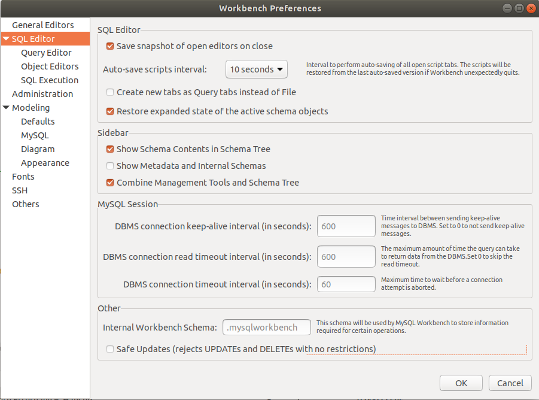

[Retur](README.md)
# Kursusgang 2

## DATABASE
For at oprette en ny database skal du bruge **CREATE**
For at slette en eksisterende database skal du bruge **DROP**

Når du vil skifte mellem hvilken database der er den aktive", skal du bruge **USE**.

**Syntaks DATABASE**

```
	CREATE DATABASE database_navn
	
	DROP DATABASE database_navn
	
	USE database_navn
```

Du skal være opmærksom på at du **ikke** får nogle advarsler ved brugen af DROP og det er ikke muligt at fortryde denne kommando.

Hvis du vil se alle de databaser der er på din MySQL server, kan du brugere denne SQL kommando

```
SHOW DATABASES;
```

## Datatyper
Hvert felt en database har et navn og en datatype.   
Datatypen "styre" hvilke data det er muligt at gemme i feltet.
I MySQL er datatyperne opdelt i 3 hovedgrupper:

* Tekst
* Tal
* Dato

Du kan hente en oversigt over MySQL's datatyper her: [Datatyper](MySQL_Data_Types.pdf)

## TABLE
Det er i dine tabeller at data gemmes. For at oprette en tabel brugere du SQL kommandoen **CREATE TABLE**

**Syntaks CREATE TABLE**

```
	CREATE TABLE tabel_navn
	(
		kolonne_1 datatype,
		kolonne_2 datatype,
		kolonne_3 datatype,		
		....
	);
	
	CREATE TABLE	Kunder
	(
		Kunde_Id INT,
		Kunde_Navn VARCHAR(60)
	);
```

Hvis du vil slette en tabel skal du bruge SQL kommandoen **DROP TABLE**

Bemærk at alle data slettes og det er ikke muligt at fortryde denne kommando.

**Syntaks DROP TABLE**

```
	DROP TABLE tabel_navn;
	
	DROP TABLE Kunder;
```

Når du har oprettet en tabel skal du bruge SQL kommandoen **ALTER TABLE** for at ændre den.

Du kan udføre følgende ændringer:

* Tilføj en kolonne
* Slet en kolonne
* Ændre en eksisterende kolonne

**Tilføj en kolonne**
For at tilføje en kolonne skal du bruge denne SQL kommando

```
	ALTER TABLE table_navn
	ADD kolonne_navn datatype;
	
	ALTER TABLE Kunder
	ADD Kunde_Adresse VARCHAR(50);
```

**Slet en kolonne**
For at slette en kolonne skal du bruge denne SQL kommando

```
	ALTER TABLE table_navn
	DROP COLUMN kolonne_navn;
	
	ALTER TABLE Kunder
	DROP COLUMN Kunde_Adresse;
```

**Ændre en eksisterende kolonne**
For at ændre en eksisterende kolonne skal du bruge SQL kommando **MODIFY**

```
	ALTER TABLE table_navn
	MODIFY COLUMN kolonne_navn datatype;
	
	ALTER TABLE Kunder
	MODIFY COLUMN Kunde_Adresse VARCHAR(80);
```


## PRIMARY KEY
En primærnøgle er et felt der unikt definere en bestemt post.
Primærnøglefelter **skal** indeholde unikke værdier og må ikke være tomme (NULL).

En tabel kan kun have **en** primærnøgle, men denne kan godt være en kombination af flere felter.

Du tilføjer en primærnøgle, ved oprettelsen af en tabel, på følgende måde:

```
	CREATE TABLE Kunder
		(
			Kunder INT PRIMARY KEY,
			Kunde_Navn VARCHAR(60)
		);
	    
	CREATE TABLE Kunder
		(
			Kunde_Id INT,
			Kunde_Navn VARCHAR(60),
			PRIMARY KEY (Kunde_Id)
		); 
```

Hvis du skal tilføje en primærnøgle efter at tabellerne er oprettet skal du bruge ALTER TABLE

```
	ALTER TABLE Kunder
	ADD PRIMARY KEY (Kunde_Id);

eller med et navn

	ALTER TABLE Kunder
	ADD CONSTRAINT PK_KundeId PRIMARY KEY (Kunde_Id);	
```

Det er ikke et krav at en tabel har en primærnøgle, men det er **klart** at anbefale.


## NOT NULL
Et felt uden en værdi har i SQL værdien NULL. Det må **ikke** forveksles med værdien 0. En NULL værdi kommer når der ikke indsættes nogen værdi i feltet.

Som standard kan alle kolonner, undtaget primærnøglekolonnen, indeholde NULL værdier. Det er muligt for dig at styre om det skal være muligt at indsætte NULL værdier eller ej. På denne måde kan du gennemtvinge at et felt altid indeholder en værdi.

```
	CREATE TABLE	Kunder
	(
		Kunde_Id INT NOT NULL,
		Kunde_Navn VARCHAR(60) NOT NULL,
		Kunde_Adresse VARCHAR (50) 
	);
```

Hvis du efter at have oprettet en tabel har behov for at tilføje en NOT NULL betingelse skal du bruge denne SQL kommando:

```
	ALTER TABLE Kunder
	MODIFY Kunde_Adresse VARCHAR (50) NOT NULL;
```

Tit er der behov for at finde felter der har værdien NULL. For at gøre dette skal du bruge **IS NULL** kommandoen.

```
	SELECT *
	FROM tabel_navn
	WHERE kolonne_navn IS NULL
```

**Northwind Syntaks IS NULL**

```SQL
	select * 
	from Employees
	where Fax is null;
```

Du kan også bruge IS NOT NULL

```
	SELECT *
	FROM tabel_navn
	WHERE kolonne_navn IS NOT NULL
```

## DEFAULT
Det er muligt at oprette en default værdi for en kolonne, der indsættes hvis der ikke specificere en værdi.

```
	CREATE TABLE Kunder
		(
			Kunde_Id INT PRIMARY KEY,
			Kunde_Navn VARCHAR(60),
	        Kunde_OpretDate DATETIME DEFAULT NOW()
		);
```

Du kan slette en default betingelse med

```
	ALTER TABLE Kunder
	ALTER COLUMN Kunde_OpretDate DROP DEFAULT;	
```


## AUTO INCREMENT
Ved at bruge **AUTO INCREMENT** kan du automatisk få et fortløbende nummer på en kolonne. Det vil typisk være din primærnøgle.

```
	CREATE TABLE	Kunder
	(
		Kunde_Id INT PRIMARY KEY AUTO_INCREMENT,
		Kunde_Navn VARCHAR(60) NOT NULL,
		Kunde_Adresse VARCHAR (50) 
	);
```

Som default starter AUTO INCREMENT på 1, men det kan du ændre ved at bruge denne SQL kommando

```
	ALTER TABLE Kunder AUTO_INCREMENT=100;
```

**Bemærk** - hvis du sletter en post vil du ikke få dens "nummer" igen.


## INSERT INTO
En tabel uden data bliver hurtig kedelig - for at indsætte data i en tabel skal du bruge SQL kommandoen **INSERT INTO**

```
	INSERT INTO tabel_navn (kolonne1, kolonne2, ...)
	VALUES (værdi1, værdi2, ...);
	
	INSERT INTO Kunder (Kunde_Id, Kunde_Navn, Kunde_Adresse)
	VALUES (100, 'Vin importen', 'Kongevejen 2');
```

Hvis du tilføjer værdier for **alle** felter er det ikke nødvendigt at angive kolonnerne. Det er dog vigtigt at du holder rækkefølgen. 

```
	INSERT INTO Kunder
	VALUES (100, 'Vin importen', 'Kongevejen 2');
```

Hvis du **kun** vil tilføje værdier til bestemte felter skal disse angives

```
	INSERT INTO Kunder (Kunde_Id, Kunde_Navn)
	VALUES (101, 'Cykel importen');
```


## UPDATE
Hvis du vil ændre på eksisterende værdier skal du bruge UPDATE kommandoen.

```
	UPDATE tabel_navn
	SET kolonne1 = værdi1, kolonne2 = værdi2, ...
	WHERE betingelse;
	
	UPDATE Kunder
	SET Kunde_Navn = 'Hellstern'
	WHERE Kunde_Id = 2;
```

**Bemærk** - hvis du **ikke** har en WHERE betingelse vil det være **hele** kolonnen der bliver opdateret. 

Det vil typisk være primærnøglen der bruges i WHERE betingelsen.


## DELETE
Hvis du vil slette en post skal du bruge DELETE

```
	DELETE FROM tabel_navn
	WHERE betingelse;
	
	DELETE FROM Kunder
	WHERE Kunde_Id = 2;
```

Husk at bruge en WHERE betingelse, ellers vil du få slettet alle poster i tabellen.


## SAFE MODE
Som standard har MySQL en sikkerhed indbygget der gør at du ikke kan slette (DELETE) eller opdatere (UPDATE) uden at du angiver en WHERE betingelse med en primærnøgle.

Disse virker **IKKE** hvis SAFE MODE er aktiv.

```
	DELETE FROM Kunder
	WHERE Kunde_Navn = 'Cykel Importen';
	
	UPDATE Kunder
	SET Kunde_Adresse = 'Kongevejen 4'
	WHERE Kunde_Navn = 'Cykel Importen';
```

Hvis du ønsker at slette eller opdatere uden at bruge en primærnøgle, kan du ændre denne sikkerhedsindstilling på 2 måder.

**Via SQL**
Indsæt denne SQL kommando før din DELETE/UPDATE sætning

```
	SET SQL_SAFE_UPDATES = 0;
```

Da denne indstilling faktisk er en rigtig god sikkerhedsindstilling vil det være en anbefaling at sætte den retur når du har udført dine kommandoer.

```
	SET SQL_SAFE_UPDATES = 1;
```

**Via GUI-Workbench**
Du kan også gøre dette via Workbench, fordelen/ulempen ved denne metode er at det er en permanent indstilling.

**Edit > Preferences > Sql Editor > Safe Updates**

Fjern markering i **Safe Updates**



# Næste gang - 27. april
I skal læse følgende i SQL in easy steps

Kapitel 13 - joining database tables

Projekt 2 afleveres (som en EXCEL-fil)
Oversigt over tabeller med datatyper. 
Første skridt til et ER-diagram. 
Fx hvis opgaven var at lave et Hotels database: En tabel med personer og en tabel med rum. 

Aflevering af opgave 2

# Opgave 2
Du kan hente opgave 2 her som PDF - [Opgave 2](Opgave_2.pdf)


Christian Boesens noter med eksempler fra kursusgang 2: [Link til pdf-fil](https://drive.google.com/open?id=1kIY24NtGpaJJCudPOX9raBjCrQN1-Dx4 "https://drive.google.com/open?id=1kIY24NtGpaJJCudPOX9raBjCrQN1-Dx4")


Løsning til opgave 2 - [Løsning opgave 2](sql_filer/Opgave_2.sql)


[Retur](README.md)
